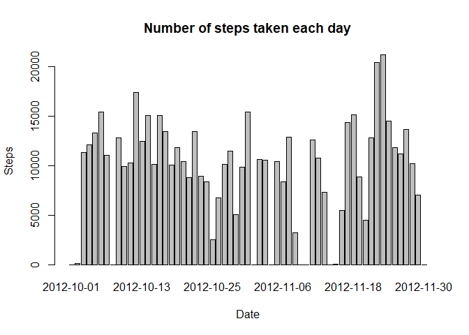
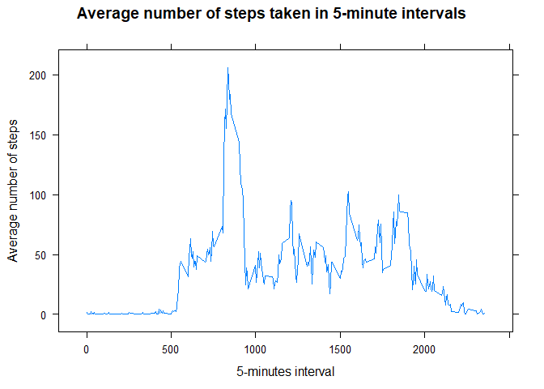
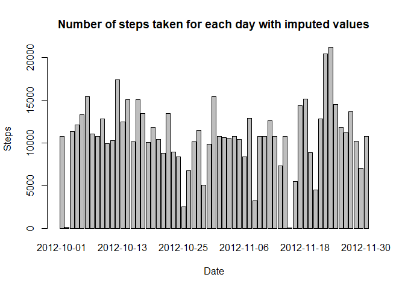
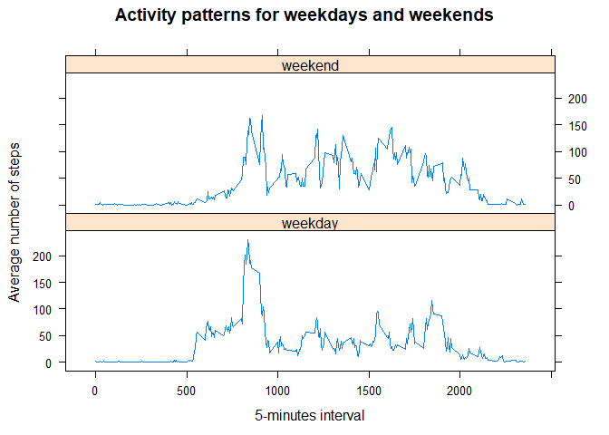

## Loading and preprocessing the data

```r
unzip("activity.zip")
activity <- read.csv("activity.csv", na.strings = "NA", stringsAsFactors = FALSE)
activity <- tbl_df(activity)
activity <- activity %>% mutate(date=as.Date(date))
```

## What is mean total number of steps taken per day?

### Calculate the total number of steps taken per day


```r
activity_byday <- activity %>% group_by(date) %>% summarize(steps = sum(steps, na.rm = TRUE))
```

### Histogram of the total number of steps taken each day


```r
barplot(activity_byday$steps, main = "Number of steps taken each day", xlab = "Date" , ylab = "Steps", names.arg = activity_byday$date)
```

<!-- -->

### Mean and median of the total number of steps taken per day


```r
steps_mean <- as.integer(mean(activity_byday$steps))
steps_median <- as.integer(median(activity_byday$steps))
```

Mean of the total number of steps: 9354

Median of the total number of steps: 10395

## What is the average daily activity pattern?

### Plot of the average number of steps taken in 5-minute intervals


```r
activity_by_int <- activity %>% group_by(interval) %>% summarize(steps = mean(steps, na.rm = TRUE))
xyplot(steps ~ interval, data = activity_by_int, type = "l", xlab = "5-minutes interval", ylab = "Average number of steps", main = "Average number of steps taken in 5-minute intervals")
```

<!-- -->

### Which 5-minute interval, on average across all the days in the dataset, contains the maximum number of steps?

```r
max_int <- filter(activity_by_int, steps == max(activity_by_int$steps))
max_interval <- max_int$interval[1]
max_steps <- max_int$steps[1]
```

Maximum number of steps is in 835 interval (206.1698113 steps)

## Imputing missing values

###Calculate and report the total number of missing values in the dataset


```r
na_count <- sum(is.na(activity$steps))
```
There're 2304 missing values in the dataset

### Devise a strategy for filling in all of the missing values in the dataset. 

Strategy for filling in missing values will be use of the mean for 5-minute interval instead of missing value.

### Create a new dataset that is equal to the original dataset but with the missing data filled in

```r
activity_imp <- activity %>% group_by(interval) %>% mutate(steps = ifelse(is.na(steps), mean(steps, na.rm = TRUE), steps))
```

### Make a histogram of the total number of steps taken each day and Calculate and report the mean and median total number of steps taken per day. Do these values differ from the estimates from the first part of the assignment? What is the impact of imputing missing data on the estimates of the total daily number of steps?


```r
activity_by_day_imp <- activity_imp %>% group_by(date) %>% summarize(steps = sum(steps, na.rm = TRUE))
barplot(activity_by_day_imp$steps, main = "Number of steps taken for each day with imputed values", xlab = "Date" , ylab = "Steps", names.arg = activity_by_day_imp$date)
```

<!-- -->

```r
steps_mean_imp <- as.integer(mean(activity_by_day_imp$steps))
steps_median_imp <- as.integer(median(activity_by_day_imp$steps))
```

Mean of the total number of steps with imputed values: 10766.  Mean increased by 1412.

Median of the total number of steps with imputed values: 10766. Median increased by 371.

## Are there differences in activity patterns between weekdays and weekends?

### Create a new factor variable in the dataset with two levels -- "weekday" and "weekend" indicating whether a given date is a weekday or weekend day.

We're defining factor for day type and defining function which will return day type for weekday abbreviation (abbreviation is in Russian locale)


```r
daytypefactor <- factor(c("weekend","weekday"))


isWeekend = function(x){
        if(x[1] %in% c('Сб','Вс')){
                return(daytypefactor[1])
        }
        return(daytypefactor[2])
}


activity_imp <- activity_imp %>% group_by(date) %>% mutate(daytype = isWeekend(weekdays(date, TRUE)))
```


### Make a panel plot containing a time series plot of the 5-minute interval (x-axis) and the average number of steps taken, averaged across all weekday days or weekend days (y-axis).


```r
activity_by_int_daytype <- activity_imp %>% group_by(interval, daytype) %>% summarize(steps = mean(steps, na.rm = TRUE))


xyplot(steps ~ interval | daytype, data = activity_by_int_daytype, type = "l", xlab = "5-minutes interval", ylab = "Average number of steps", main = "Activity patterns for weekdays and weekends", layout = c(1, 2))
```

<!-- -->

